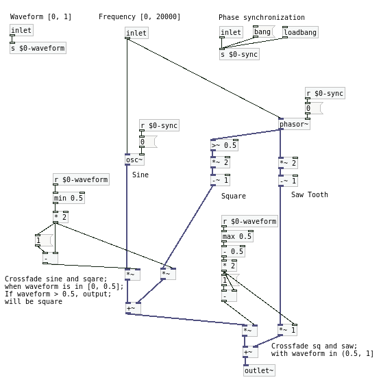
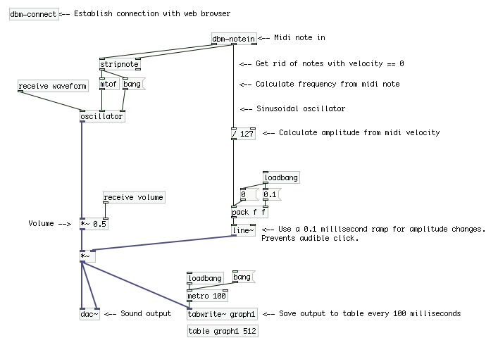
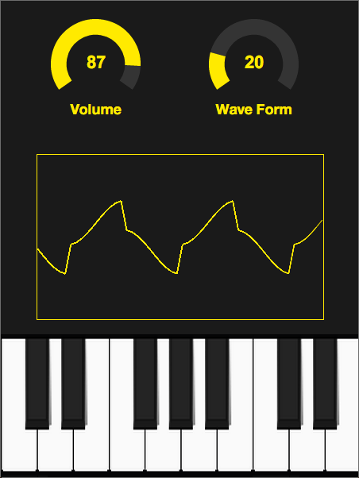

## Tutorial

This tutorial explains how to build a simple synthesizer using the Dancing Bone Machine toolkit. Here's what we are going to build:

<div style="text-align:center">
<iframe width="500" height="400" src="http://player.vimeo.com/video/93681471" frameborder="0" webkitAllowFullScreen mozallowfullscreen allowFullScreen></iframe> 
</div>

You can either start from scratch and follow the following steps or you can download the complete code for the synth. If you choose the later, use git to get the synth's code, the DBM toolkit and it's dependencies using the following commands. Either way, you can look at the code at https://github.com/dancing-bone-machine/example

``` bash
git clone https://github.com/dancing-bone-machine/example.git dbm-sample-synth
cd dbm-sample-synth
git submodule update --init --recursive
```

### 1. Create an empty DBM application.

Create a local git repository for your project and use the following git commands to download DBM and it's dependencies:

``` bash
$ mkdir sample-synth
$ cd sample-synth
$ git init
$ git submodule add https://github.com/dancing-bone-machine/dancing-bone-machine dbm
$ git submodule update --init --recursive
```

Then, create the directory structure for your application:

``` bash
$ dbm/scripts/create-app.sh
```

### 2. Build a simple synth in PD

All of the PD files we'll create will be located in `sample-synth/app/pd/patches`.

Our PD patch will have to perform the following tasks: analyze the MIDI input so that we know which note to play and when to stop, generate the sound waves with the proper waveforms and frequencies, generate an envelope for waves so that they can start and stop playing as the MIDI events come in, and store the sound sound output in a table so the GUI can read it and display it. Let's begin:

#### 2.1 Generating sound waves

This is done in the oscillator.pd file which looks like this:

<a href="images/oscillator.png"></a>

We are generating three different waveforms that are typically found in analog electronic synthesizers: sine, square and sawtooth waveforms. 

The sine waves' timbre can be described as “smooth” or “soft”, resembles the sound of some wind instruments like the flute or someone whistling with their mouth and can be used successfully for electronic bass lines. To generate the sine wave, an [osc~] object is used.

The sawtooth wave's timbre can be described as “harsh”, in some way resembles the sound of bowed violins or cellos and can be used for lead lines in electronic music. To generate the sawtooth wave, a [phasor~] object was used. Tis objects generates a waveform that ramps up from a value of zero to a value of 1 in a time equal to one period of the generated signal (1/frequency) and then quickly drops to zero to start over again. To generate the sawtooth we simply multiply the output of the phasor by two, getting values from zero to two and then substract one, so the sawtooth wave oscillates between minus one and one.

The square wave's timbre can be placed perceptually in the middle of the sine and sawtooth wave, can be described as “hollow” and is sometimes used to emulate the sound of distorted electric guitars or some wind instruments (with additional filtering). To get the square wave, we use the output of the same [phasor~] object as before and compare with a value of 0,5. If the value is higher, we output a value of 1 and if it's lower, we output a value of -1. 

There is also the matter of synchronizing the phase of the oscillators. To do that, we simply send a "0" message to the right inlet of the oscillators [osc~] and [phasor~] when a new MIDI note arrives. This prevents some audible clicks in the generated signal by always starting the signal output wihth a value of zero.

Finally, using four multipliers and two adders, we implement a three way cross fade that allows us to output blended signals. Users can turn the "waveform" knob to the left to get a sine waveform, put it on in the middle to get a square wave, to the right for a saw-tooth and other in-between values to get different waveforms.

#### 2.2 MIDI input and envelope

The rest of the synth is implemented in the synth.pd patch:

<a href="images/synth.png"></a>
The patch must be saved in the app/pd/patches directory.

To set the frequency of the oscillator block, we use a midi notein value and the [mtof] object. For the envelope, the midi velocity value is used to calculate a simple line envelope and the [receive volume] signal is used to set the amplitude value of the oscillator.

We are also storing 512 samples of the output signals every 100 milliseconds into the [table graph1 512] object. This will be used to plot the wave in the HTML interface.

[dbs-connect] is used to establish communication between your patch and the HTML part of your app. Also, notice that instead of using the regular [notein] object, we're using [dbs-notein]. They behave equally but [dbs-notein] receives midi events from both actual midi ports and from the HTML interface.

### 3. Build a graphical user interface using HTML

Your HTML application must live in the app/html/index.html file. You can also have stlesheets, scripts and other assets in there. I will only highlight the important parts, you can look at the details in the [HTML](https://github.com/dancing-bone-machine/example/blob/master/app/html/index.html) and [JavaScript](https://github.com/dancing-bone-machine/example/blob/master/app/html/scripts/sample-app.js) files.

Note that the `scripts/dancing-bone-machine/dancing-bone-machine.js` script must be loaded by the HTML.

Here is what the interface looks like when rendered in a browser.

<p style="max-width:452px; margin: 0px auto"> <a href="images/gui.png" ></a> </p>

#### Knobs

The knobs were created using [jQuery Knob](http://anthonyterrien.com/knob/):

```html
<input id="volume" type="tel" class="knob" value="50" data-min="0" data-max="100" />
```

```js
var w = $('#controls').innerWidth();
var h = $('#controls').innerHeight();
var options = {
    'fgColor': '#ffec03',
    'inputColor': '#ffec03',
    'bgColor': '#444444',
    'angleOffset': '-125',
    'angleArc': '250',
    'width': Math.ceil(w * 0.25),
    'height': Math.ceil(w * '0.22')
};

var opts2;
// Volume
opts2 = $.extend({'change': function(v){
    PD.sendFloat(v/100, 'volume');
}}, options);
$("#volume").knob( opts2 );
```

#### Piano Keyboard

The piano keyboard was created using a simple background [image](https://github.com/dancing-bone-machine/example/blob/master/app/html/styles/piano.png) and some divs to capture mouse/touch events.

```html
<div id="piano-scroll">
 <div id="piano">
    <div class="octave" data-octave="4">
       <div class="key white" data-note-number="0"></div>
       <div class="key white" data-note-number="2"></div>
       <div class="key white" data-note-number="4"></div>
       <div class="key white" data-note-number="5"></div>
       <div class="key white" data-note-number="7"></div>
       <div class="key white" data-note-number="9"></div>
       <div class="key white" data-note-number="11"></div>
       <div class="blacks">
          <div class="key" data-note-number="1"></div>
          <div class="key more-margin" data-note-number="3"></div>
          <div class="key" data-note-number="6"></div>
          <div class="key" data-note-number="8"></div>
          <div class="key" data-note-number="10"></div>
       </div>
    </div>
```

```js
this.pressedKey = function(event){
  event.preventDefault();
  
  // Calculate midi note number and send midi note on event
  var key = $(event.currentTarget);
  var octaveNumber = key.closest('.octave').attr('data-octave');
  var noteNumber = octaveNumber*12 + Number(key.attr('data-note-number'));
  $(key).addClass("pressed");
  lastKey=key;
  playingNote=noteNumber;
  PD.sendNoteOn(0, noteNumber, 65);
};

this.releasedKey = function(event){
  event.preventDefault();

  $(lastKey).removeClass("pressed");
  PD.sendNoteOn(0, playingNote, 0);
  playingNote = -1;
};
```

#### Oscilloscope

The oscilloscope was created using the &lt;canvas&gt; tag and JavaScript API.

```js
oscilloscope.context.strokeStyle="#FFEC03";
var y = 0;
var i = 0;
var j = 0;
for(i=0; i<oscilloscope.w; i=i+oscilloscope.jumpPixels){
   y = oscilloscope.scale + oscilloscope.scale*points[j*oscilloscope.jumpPoints];
   oscilloscope.context.lineTo(i,y);
   oscilloscope.context.stroke();
   j++;
}
```

#### Opening the patch and sending messages

Here's the core of all this. To establish communication with the PD patch and send messages, you need to use the Dancing Bone Machine JavaScript API like so:

```js
PD.configurePlayback(44100, 2, false, false, function(){
   PD.openFile('pd/patches', 'synth.pd', function(){
      PD.setActive(true);
      PD.sendFloat(0.5, 'waveform');
      PD.sendFloat(0.5, 'volume');
   });
});

//...

PD.sendNoteOn(0, noteNumber, 65);
```

### 4. Running in debug mode

The simplest way to run your app is to open the index.html file in a browser and the synth.pd patch in either Pure Data or Pd-extended. You must add the library/dancing-bone-machine/pd/externals/bin directory to the PureData search path so that the externals and abstractions that we provide can be found by PD.

### 5. Generating an iOS wrapper application

A generator script is included as part of Dancing Bone Machine. You can use it as follows:

```bash
$ cd sample-synth
$ dbm/scripts/create-ios-wrapper.sh
```

This will create an Xcode project with all the configurations needed to run your HTML interface and your PD patch within an iOS application. Open the `app/wrappers/ios/DancingBoneMachine.xcodeproj` project with Xcode and follow [Apple's guidelines](https://developer.apple.com/devcenter/ios/index.action) to run the app in the iOS simulator or in an actual iOS device.

### 6. Generating a Windows or MacOS wrapper application

Similarly, you can use the `create-qt-wrapper.sh` script as follows to create a [QT](qt-project.org) project you can compile in Windows or MacOS. 

```bash
$ cd sample-synth
$ dbm/scripts/create-qt-wrapper.sh
```

And then, to compile the app:

```bash
$ cd sample-synth/wrappers/qt
$ qmake
$ make
```
