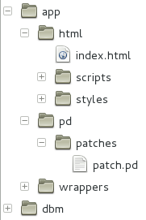
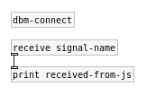
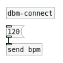
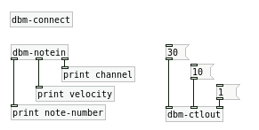

## Guide.

The Dancing Bone Machine is implemented as a set of scripts and programming code that allow you to write musical applications using PureData for making sounds and HTML/JavaScript for graphical user interfaces (GUIs). It does so by supporting 3 basic features:

* Provides a PureData and JavaScript [API](api.html) that allows you to communicate both sides of your app.
* Allows you to use the API functions and objects while running your HTML code on a web browser and your Pd patches on Pd-extended (or vanilla Pd). We call this the development or the debugging environment.
* Generates wrapper code that can be compiled for MacOS, Windows and iOS so you can distribute your apps on this platforms.

### 0. What you need.

All the scripts in DBM are meant to run on a Unix-like command line, the built-in terminal applications in MacOS and Linux will work but you'll need to install MinGW on Windows (more on MinGW below). You'll also need to have the [git](http://www.git-scm.com/book) version control system installed.

If you want to run your code in the development environment all you need is a webkit based web browser and your favorite flavor of PureData. We have tested this on Linux (Debian and Ubuntu) using the Chromium browser and Pd-extended and on MacOS 10.8 using Google Chrome and Pd-extended. The PD external [websocket_server] that makes this possible has not been compiled for Windows.

For the creation of iOS applications, you'll need to install [Xcode](https://developer.apple.com/xcode/) and the [Xcode command line tools](https://developer.apple.com/downloads/index.action).

You'll also need to install the [QT framework](http://qt-project.org/downloads) on MacOS and/or Windows if you want to create applications for these platforms. On Windows, make sure you download and install the MinGW version of QT.

As mentioned, you'll need [MinGW](http://mingw.org/) if you want to create Windows applications. Download it from [here](http://sourceforge.net/projects/mingw/files/Installer/mingw-get-setup.exe/download) and install it. At a certain point in the installation, you will be asked which packages you want to install. Make sure you select msys. 

After it's done, create a shortcut to C:\MinGW\msys\1.0\msys.bat somewhere, that's what you'll use to launch the MinGW terminal and create a file called `C:\MinGW\mysys\1.0\home/<username>/.profile` with the following contents:

```
export PATH=/c/Qt/Qt5.2.1/5.2.1/mingw48_32/bin:/c/Qt/Qt5.2.1/Tools/mingw48_32/bin:$PATH
```

Finally, create a file called `C:\MinGW\msys\1.0\etc\fstab` with a line that reads `C:\Qt\Tools\mingw48_32  /mingw`

### 1. Getting the toolkit and creating an application.

First, you'll create a local git repository for your project and use some git commands to download DBM and it's dependencies:

``` bash
$ mkdir your-project
$ cd your-project
$ git init
$ git submodule add https://github.com/dancing-bone-machine/dancing-bone-machine dbm
$ git submodule update --init --recursive
```

Then, create the directory structure for your application:

``` bash
$ dbm/scripts/create-app.sh
```

 You'll end up with a directory structure like the one on the image. Use the `app/html` and `app/pd/patches` directories to put your HTML (with scripts, images, style sheets and other asssets) and PureData files. The `app/wrappers` directory is where the wrapper applications will be created. The content of all the other directories is only relevant if you plan to hack on the DBM itself, which is not covered by this guide.  

<div class="clear"></div>

### 2. Coding your app and using the API.

The "controller" logic of your application should be implemented using JavaScript and you can use any JS library you choose. The first thing you have to do in your `index.html` page is to include the `dancing-bone-machine.js` script and implement a function called `main`. This function will be called by DBM once everything is ready to go. DBM uses the [RequireJs](http://www.requirejs.org/) module loader to include additional scripts depending on which environment the app is running (development environment, one of the wrapper applications, etc.) so you can optionally use RequireJS' functions to load your scripts.

#### 2.1 Starting the audio engine and loading patches.

It is your responsibility to start the audio engine of the application and to load the PD patch you'll use. You can do this at any time but it'll usually be done on the `main` function right after the application starts. To do this, you'll use the `PD.configurePlayback` and `PD.openFile` functions. Also, the `PD.setActive` functions allows you to turn DSP processing on and off. Here is a basic example:

``` html
<!DOCTYPE HTML>
<html>
<head>
   <script src="scripts/dancing-bone-machine/dancing-bone-machine.js" type="text/javascript"></script>
   <script type="text/javascript">
      function main(){
         // Init PureData engine and load a patch called patch.pd.
         PD.configurePlayback(44100, 2, false, false, function(){
            PD.openFile('pd/patches', 'patch.pd', function(){
               // Turn DSP processing ON.
               PD.setActive(true);
            });
         });
    };
   </script>
</head>
<body></body>
</html>

```

On the PD side, you have to put a [dbm-connect] object in your patch to establish communication with the JavaScript side.

#### 2.2 Sending messages to PD.

You can use the `send*` functions to send any kind of message to PD. This works just like the [send] object in PD so on the PD side, you simply use the [receive] object to get them. As an example, this is how you would send and receive a "Hello" symbol from JS to PD:



``` js
PD.sendSymbol("Hello", "signal-name");
```

<div class="clear"></div>

#### 2.3 Receiving messages from PD.

To send messages from PD, you simply use the [send] object specifying a signal name. On the JS side, you must "subscribe" to this signal and a callback function will be triggered when the message is received. This is done with the `PD.bind` function.



``` js
PD.bind("bpm", function(value){
    console.log("The current bpm is " + value);
});
```

<div class="clear"></div>

#### 2.4 Sending and receiving MIDI events.

MIDI events are sent and received in the same way as "regular" messages, but instead of using PD's built in [send] and [receive] objects, you must use DBM's MIDI objects. Here is an example on sending and receiving MIDI events:



``` js
PD.sendNoteOn(65, 127, 1);
PD.bindMidiControlChange(function(controller, value, channel){
    console.log("A MIDI CC message was received: " + controller + " " + value);
    console.log("On channel " + channel);
});
```

### 3. Running your app on a web browser + Pd-extended.

The simplest way to run your full application is to open your HTML document on a web browser and your PD patch on Pd-extended. DBM will setup communication automatically and you should see a message like "Established connection with patch.pd" on the JavaScript console and "websockets_server: Connection established." on the PD console.

### 4. Exporting as an iOS application.

Running the commands below on a terminal in MacOS will generate a new directory `app/wrappers/ios` that will contain the code for an iOS version of your application. The application is based on [Apache Cordova](https://cordova.apache.org/), [Xcode](https://developer.apple.com/xcode/) and the [iOS SDK](https://developer.apple.com/devcenter/ios/index.action) so you should familiarize yourself with them if you want to tweak the application further, run it on the iOS simulator or on your iOS device and publish it on iTunes.

``` bash
$ cd your-project
$ dbm/scripts/create-ios-wrapper.sh
```

### 5. Exporting as a MacOS or Windows application.

Similarly, if you run the commands below on a MinGW terminal in Windows or in the MacOS terminal, you will get a directory `app/wrappers/qt` that will contain the code for an desktop version of your application, which can be compiled on Windows or MacOS. The application is based on the C++ [QT framework](http://qt-project.org) so you should familiarize yourself with it if you want to tweak the application further, or distribute it as Windows or MacOS executables.

``` bash
$ cd your-project
$ dbm/scripts/create-desktop-wrapper.sh
```

To compile the app, you can simply do

``` bash
$ cd your-project/app/wrappers/qt
$ qmake
$ make
```
