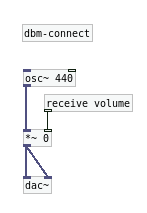

## Overview

The Dancing Bone Machine is a toolkit that allows you to create audio and music applications for iOS, MacOS and Windows using [PureData](http://puredata.info) and HTML. Linux apps and VST plug-ins are coming soon (see the [roadmap](https://github.com/dancing-bone-machine/dancing-bone-machine/issues/5) for discussion).

Here's a short summary of how it works. There are more detailed instructions in the [Guide](/guide.html).

#### 1. Create a DBM project

``` bash
$ mkdir your-project
$ cd your-project
$ git init
$ git submodule add https://github.com/dancing-bone-machine/dancing-bone-machine dbm
$ git submodule update --init --recursive
$ dbm/scripts/create-app.sh
```

#### 2. Use the DBM API to connect your JavaScript and PureData code.

In your-project/app/html/index.html:

``` html
...
<script src="scripts/dancing-bone-machine/dancing-bone-machine.js" type="text/javascript"></script>
...
<button id="btn" type="button" onmouseup="beep();">Beep.</button>
<script type="text/javascript" charset="utf-8">
  function beep(e){
      PD.sendFloat(1, 'volume');
  }
</script>
...
```

In your-project/app/pd/patches/patch.pd:



#### 3. Test and debug your app with your preferred tools.
 
You'll be able to run and debug your HTML/JavaScript code in your favorite [webkit based web browser](http://en.wikipedia.org/wiki/WebKit#Use) while editing and running your PD patch in either [Pure Data](http://puredata.info/downloads/pure-data) or [Pd-extended](http://puredata.info/downloads/pd-extended). This is possible thanks to our [[websockets_server]](https://github.com/dancing-bone-machine/dancing-bone-machine/tree/master/library/dancing-bone-machine/pd/externals/src/websocket_server) object in PD.

If you don't plan on distributing your application, this is all you need.

<iframe src="http://player.vimeo.com/video/93271982" width="500" height="400" frameborder="0" webkitAllowFullScreen mozallowfullscreen allowFullScreen></iframe> 


#### 4. Export your app using the included scripts.

``` bash
$ dbm/scripts/create-ios-app.sh
$ dbm/scripts/create-desktop-app.sh
```

You'll get an Xcode or a qmake project you can use to compile your app as a Windows, MacOS or iOS binary.

### More help, please!

If none of this makes sense to you, but you still want to make some musical software, head to the [prerequisites section](/prerequisites.html) and spend some time reading the linked resources, you'll be fine when you come back.

### Licensing

The Dancing Bone Machine toolkit is licensed under the [GNU Lesser General Public License with a static linking exception](https://github.com/dancing-bone-machine/dancing-bone-machine/blob/master/COPYING). All of the examples are licensed under the [GNU General Public License](http://www.gnu.org/licenses/gpl.html).

In other words:

* You get the full source code for The Dancing Bone Machine. You can examine the code, modify it and share your modified code under the terms of the LGPL.
* The Dancing Bone Machine is safe for use in closed-source applications. The LGPL share-alike terms do not apply to applications built with The Dancing Bone Machine. The LGPL applies to The Dancing Bone Machine own source code, not your applications.

### Acknowledgements

The Dancing Bone Machine leverages work from a number of projects:

* [libpd](http://libpd.cc/)
* [QT](http://qt-project.org/)
* [Apache Cordova](http://cordova.apache.org/)
* [Webkit](http://webkit.org/)
* [RequireJS](http://requirejs.org)
* [libwebsockets](http://libwebsockets.org)
* [stringencoders](http://code.google.com/p/stringencoders)
* [MinGW](http://www.mingw.org/)

